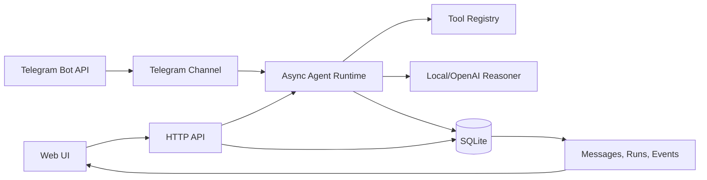

# Yuno AI Agent Orchestration Platform

Round 0 submission for the Yuno AI Engineer Hiring Challenge.

This project is a local-first AI agent orchestration platform. Users can configure agents, connect them into workflows, execute real tools, persist inter-agent messages, monitor live traces, and expose the support workflow through Telegram.

## Why This Stack

- **Python stdlib + SQLite**: one-command local setup, easy to audit, no dependency failures during review.
- **Custom async runtime**: the challenge allows a custom runtime. This implementation uses a background asyncio loop, persisted queues/runs/messages, tool execution, conditional routing, feedback loop protection, and channel callbacks.
- **Vanilla web UI**: keeps the demo portable while still showing CRUD, workflows, monitoring, and channel traffic.
- **Telegram Bot API**: simpler and more reliable than WhatsApp for a candidate demo. The app also includes a Telegram simulator so the reviewer can run the flow without a bot token.

## Architecture



Key boundaries:

- `yuno_orchestrator/server.py`: HTTP API, static UI serving, SSE monitoring.
- `yuno_orchestrator/runtime.py`: async workflow execution, agent-to-agent routing, event publishing.
- `yuno_orchestrator/storage.py`: SQLite persistence for agents, workflows, runs, messages, and events.
- `yuno_orchestrator/tools.py`: real callable tools used by agents.
- `yuno_orchestrator/telegram_channel.py`: external messaging channel integration.
- `static/`: web UI for management, workflow visualization, channel simulation, and monitoring.

## Requirements Coverage

| Requirement | Implementation |
| --- | --- |
| Agent CRUD | Agent registry and edit form in the UI, backed by `/api/agents` |
| Agent config dimensions | name, role, prompt, model, tools, channels, schedules, memory, skills, rules, guardrails |
| Runtime executes logic | async runtime calls tools, reasoner, routes workflow edges, persists traces |
| Agent-to-agent async messages | background event loop and persisted `messages` table |
| Visual workflow builder | UI renders nodes, edges, conditions, and feedback loops |
| 2 workflow templates | Customer Support Swarm, Research Brief Factory |
| External channel | Telegram polling integration plus simulator |
| Live monitoring | SSE events, persisted logs, token/cost tracking |
| Tests | agent creation, workflow execution, message delivery |

## Run Locally

Use Python 3.11+.

```powershell
python run.py
```

Open:

```text
http://127.0.0.1:8080
```

No package install is required.

For detailed laptop setup steps, see `docs/LOCAL_SETUP.md`.

## Run Tests

```powershell
python -m unittest discover -s tests
```

## Demo Workflow

Use the seeded `Customer Support Swarm` workflow with:

```text
My order ORD-1024 is delayed and I want a refund.
```

Expected trace:

1. Telegram/web message is persisted.
2. Triage Agent calls `order_lookup` and `policy_lookup`.
3. Runtime routes to Resolution Agent.
4. Resolution Agent calls `order_lookup`, `refund_calculator`, `ticket_creator`, and `policy_lookup`.
5. Final customer-safe reply is saved on the run with token/cost estimates.

## Telegram Setup

1. Open Telegram and message `@BotFather`.
2. Create a bot and copy its token.
3. Create a local `.env` file:

```text
ENABLE_TELEGRAM=true
TELEGRAM_BOT_TOKEN=<your-token>
TELEGRAM_WORKFLOW_ID=workflow-support
```

4. Verify the token:

```powershell
python scripts/telegram_smoke_test.py
```

5. Start the app:

```powershell
python run.py
```

6. Send the bot:

```text
My order ORD-1024 is delayed. Can you help and refund me?
```

The bot replies with the final agent output. The UI shows the same conversation and runtime trace.

## Optional OpenAI Mode

The default `local` reasoner is deterministic for reliable demos. To use OpenAI for response generation:

```powershell
$env:YUNO_LLM_PROVIDER="openai"
$env:OPENAI_API_KEY="<your-key>"
python run.py
```

If the API call fails, the runtime falls back to the deterministic local reasoner so the demo still completes.

## Adding a Workflow Template

1. Add or reuse agents in `yuno_orchestrator/templates.py`.
2. Add a workflow with:
   - `nodes`: each node references an `agent_id` and x/y canvas position.
   - `edges`: each edge has `from`, `to`, `condition`, and `label`.
3. Add a matching entry to `TEMPLATES`.
4. Restart or click `Seed demo`.

## Adding a Messaging Channel

Implement a new channel class with the same shape as `TelegramChannel`:

- receive external message
- call `runtime.submit(workflow_id, text, channel=name, external_reply=callback)`
- send final response through the external API
- persist channel events through `store.add_event`

## Interview Notes

The strongest explanation is that this is intentionally local-first and dependency-light for Round 0 reliability, while still respecting production boundaries: runtime, persistence, UI, and channels are separate. The tradeoff is that the local reasoner is deterministic; in production, the same runtime can use OpenAI, LangGraph, CrewAI, or another model provider behind the `Reasoner` interface.

More preparation notes are in `docs/INTERVIEW_PREP.md`.

## GitHub Submission

Publishing steps and suggested submission text are in `docs/GITHUB_SUBMISSION.md`.

## Return-To-Project Handoff

When returning after a break, open `ROUND0_HANDOFF_PLAN.md` first. It has the restart, verification, recording, Telegram, GitHub, Google Drive, and submission steps in one place.
